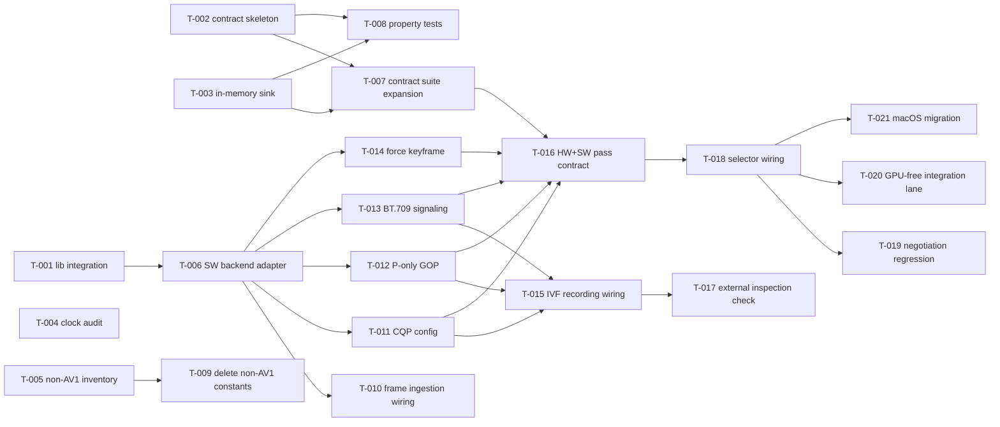

# Build Site: SVT-AV1 Encoder + Contract-Test Harness

**Scope:** Add SVT-AV1 software encoder backend; extract a shared encoder-backend contract-test suite that both HW and SW backends pass; wire backend selection to prefer HW AV1 and fall back to SVT-AV1; migrate macOS off VideoToolbox HEVC onto SVT-AV1; land a GPU-free integration lane through the SW path.

**Critical-path payoff:** Once the SW backend passes the contract suite and the GPU-free integration lane is green, the testing tier promises in cavekit-testing.md R2/R3/R4 become real — encoder-pipeline logic can be exercised on CI without a GPU.

**Tier counts:** 6 tiers (T0..T5). 21 tasks total.

## Tier 0 — No Dependencies (Parallel Kickoff)

| Task | Title | Cavekit | Requirement | Effort |
|------|-------|---------|-------------|-------|
| T-001 | Integrate SVT-AV1 encoder library into the build graph as a statically linked dependency | cavekit-capture-pipeline.md | R3, R5 | L |
| T-002 | Draft encoder-backend contract-test suite skeleton parameterized over a backend factory | cavekit-capture-pipeline.md | R3 | M |
| T-003 | Implement in-memory FrameSink double that records every emitted frame with keyframe flag and timestamps | cavekit-testing.md | R4 | S |
| T-004 | Audit encoder module for direct OS-clock reads and route any findings through the injected clock interface | cavekit-testing.md | R3 | S |
| T-005 | Enumerate and inventory all non-AV1 codec constants and VBR rate-control symbols in the codebase as a deletion worklist | cavekit-capture-pipeline.md | R5, R7 | S |

## Tier 1 — Depends on Tier 0

| Task | Title | Cavekit | Requirement | blockedBy | Effort |
|------|-------|---------|-------------|-----------|-------|
| T-006 | Implement software AV1 encoder backend adapter conforming to the encoder-backend interface (configure, submit, force-keyframe, teardown) | cavekit-capture-pipeline.md | R3 | T-001 | L |
| T-007 | Expand contract-test suite with cases covering configure, submit, forced keyframe, reconfigure-emits-keyframe, and teardown | cavekit-capture-pipeline.md | R3, R9 | T-002, T-003 | M |
| T-008 | Add property tests over encoder configuration invariants (accepted dimensions, quantizer bounds, reconfigure idempotence) using the contract-test factory | cavekit-testing.md | R2, R4 | T-002, T-003 | M |
| T-009 | Delete non-AV1 codec constants and VBR rate-control symbols identified in T-005 and confirm build remains green | cavekit-capture-pipeline.md | R5, R7 | T-005 | S |

## Tier 2 — Depends on Tier 1

| Task | Title | Cavekit | Requirement | blockedBy | Effort |
|------|-------|---------|-------------|-----------|-------|
| T-010 | Wire CPU-side frame ingestion path so the software backend accepts GPU-shared handles via a documented download step without changing caller semantics | cavekit-capture-pipeline.md | R3 | T-006 | M |
| T-011 | Configure software backend for CQP-only rate control with a single configurable quantizer and a documented default fallback | cavekit-capture-pipeline.md | R7 | T-006 | S |
| T-012 | Configure software backend for P-only GOP with self-contained keyframe headers on every keyframe | cavekit-capture-pipeline.md | R8 | T-006 | S |
| T-013 | Configure software backend to declare BT.709 primaries, transfer, matrix, and limited range in the emitted bitstream | cavekit-capture-pipeline.md | R6 | T-006 | S |
| T-014 | Implement force-keyframe semantics in the software backend covering PLI, reconfigure, and in-flight request cases | cavekit-capture-pipeline.md | R9 | T-006 | M |

## Tier 3 — Depends on Tier 2

| Task | Title | Cavekit | Requirement | blockedBy | Effort |
|------|-------|---------|-------------|-----------|-------|
| T-015 | Connect software backend to the shared session recorder so emitted bitstreams write into the AV1 IVF container on the same code path as hardware backends | cavekit-capture-pipeline.md | R12 | T-011, T-012, T-013 | S |
| T-016 | Run the contract-test suite against both the hardware AV1 backend and the software AV1 backend and resolve any divergences until both pass unchanged | cavekit-capture-pipeline.md | R3, R5, R6, R7, R8, R9 | T-007, T-011, T-012, T-013, T-014 | M |
| T-017 | Add external-inspection verification that recorded bitstreams declare BT.709 and carry no B-frames, driven from the contract-test harness | cavekit-capture-pipeline.md | R6, R8 | T-015 | S |

## Tier 4 — Depends on Tier 3

| Task | Title | Cavekit | Requirement | blockedBy | Effort |
|------|-------|---------|-------------|-----------|-------|
| T-018 | Extend backend selector to probe for hardware AV1 and fall back to the software AV1 backend, driven only by probe results, with selection and probe outcomes logged at startup | cavekit-capture-pipeline.md | R4 | T-016 | M |
| T-019 | Confirm viewer negotiation continues to advertise AV1 as the sole video codec regardless of which backend the selector chose, and add a regression assertion at the negotiation construction site | cavekit-capture-pipeline.md | R5 | T-018 | S |

## Tier 5 — Depends on Tier 4

| Task | Title | Cavekit | Requirement | blockedBy | Effort |
|------|-------|---------|-------------|-----------|-------|
| T-020 | Add a GPU-free integration lane that drives capture → software encode → IVF recording through the in-memory frame sink and expose it behind a single run.ts entry point | cavekit-testing.md | R2 | T-018 | M |
| T-021 | Migrate the macOS app-share encoder backend from the HEVC path to the shared software AV1 backend and retire the HEVC-only construction site | cavekit-capture-pipeline.md | R1, R3, R4, R5 (macOS) | T-018 | L |

## Summary

| Tier | Tasks | S | M | L |
|------|-------|---|---|---|
| 0 | 5 | 3 | 1 | 1 |
| 1 | 4 | 1 | 2 | 1 |
| 2 | 5 | 3 | 2 | 0 |
| 3 | 3 | 2 | 1 | 0 |
| 4 | 2 | 1 | 1 | 0 |
| 5 | 2 | 0 | 1 | 1 |
| **Total** | **21** | **10** | **8** | **3** |

## Coverage Matrix

Every in-scope acceptance criterion is mapped to at least one task.

### cavekit-capture-pipeline.md

| Kit AC | Criterion (abbrev.) | Task(s) | Status |
|--------|---------------------|---------|--------|
| R3 AC1 | Interface exposes configure, submit, force-keyframe, teardown | T-002, T-006, T-007 | COVERED |
| R3 AC2 | HW + SW backends pass same contract tests | T-006, T-007, T-016 | COVERED |
| R3 AC3 | Caller does not know active backend | T-006, T-010, T-016 | COVERED |
| R4 AC1 | Hosts with HW AV1 get HW backend | T-018 | COVERED |
| R4 AC2 | Hosts without HW AV1 get SW backend | T-018 | COVERED |
| R4 AC3 | Selection + probe outcomes logged | T-018 | COVERED |
| R4 AC4 | Selection driven only by probe results | T-018 | COVERED |
| R5 AC1 | Every backend emits AV1 | T-006, T-016, T-021 | COVERED |
| R5 AC2 | Removing non-AV1 constants does not reduce functionality | T-005, T-009 | COVERED |
| R5 AC3 | Viewer negotiation advertises AV1 as sole codec | T-019 | COVERED |
| R6 AC1 | Bitstream declares BT.709 + limited range | T-013, T-016 | COVERED |
| R6 AC2 | External inspection confirms declared values | T-017 | COVERED |
| R7 AC1 | Encoder accepts single quantizer at configure | T-011, T-016 | COVERED |
| R7 AC2 | Documented flag sets QP; default fallback | T-011 | COVERED |
| R7 AC3 | No VBR constants on any logic path | T-005, T-009 | COVERED |
| R8 AC1 | No B-frames in any emitted bitstream | T-012, T-017 | COVERED |
| R8 AC2 | Every keyframe self-contained | T-012, T-017 | COVERED |
| R9 AC1 | PLI → next frame is keyframe | T-014, T-016 | COVERED |
| R9 AC2 | Reconfigure → next frame is keyframe | T-014, T-016 | COVERED |
| R9 AC3 | Keyframe request during in-flight frame | T-014, T-016 | COVERED |
| R12 AC1 | No recording dir → no files, no extra work | T-015 | COVERED |
| R12 AC2 | With dir → distinct file per share | T-015 | COVERED |
| R12 AC3 | Recorded file playable by standard inspector | T-015, T-017 | COVERED |
| R12 AC4 | Recording I/O failure does not crash | T-015 | COVERED |
| macOS R1 / R5 GAP | macOS backend migrated to SVT-AV1 (AV1 only) | T-021 | COVERED |

### cavekit-testing.md (criteria unlocked by SW backend)

| Kit AC | Criterion (abbrev.) | Task(s) | Status |
|--------|---------------------|---------|--------|
| R2 AC1 | Unit tier runs without GPU | T-007, T-008, T-016 | COVERED |
| R2 AC2 | Property tier exercises decoders/state/roundtrips | T-008 | COVERED |
| R2 AC3 | Integration tier exercises capture→encode→transport | T-020 | COVERED |
| R3 AC1 | Time reads through injected clock | T-004 | COVERED |
| R3 AC2 | Encoder backend / frame sink / transport are interfaces at construction | T-006, T-018 | COVERED |
| R3 AC3 | No direct OS-clock calls in logic modules | T-004 | COVERED |
| R4 AC1 | Every interface has production impl + double, both pass contract tests | T-003, T-006, T-016 | COVERED |
| R4 AC3 | In-memory frame sinks store produced bytes for assertions | T-003 | COVERED |

No row is GAP.

## Dependency Graph

## Critical Path

T-001 → T-006 → T-011 (or T-012 / T-013 / T-014 in parallel) → T-016 → T-018 → T-020. Minimum chain to realize the "GPU-free testing unlocked" payoff.

Parallelizable work around the critical path:
- Tier 0: T-002, T-003, T-004, T-005 all run while T-001 is in flight.
- Tier 2: T-010, T-011, T-012, T-013, T-014 are mutually independent once T-006 lands.
- Tier 5: T-020 and T-021 are mutually independent.
